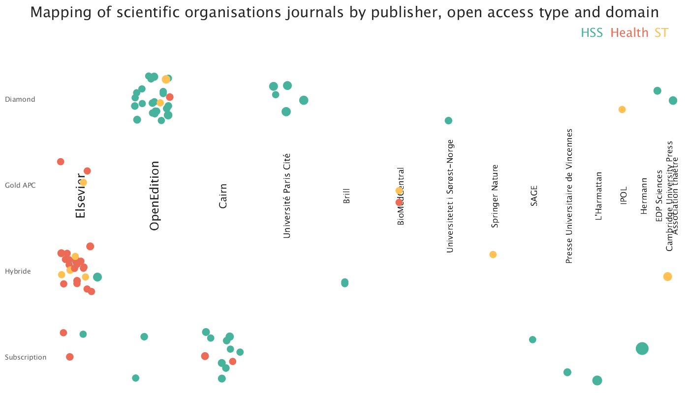

# Editorial activities at Université Paris Cité in 2022

In the context of the new publishing platform, [OPUS](https://opus.u-paris.fr), one of the goal was to shed light on the institution's editorial activities, which is to answer to the following question _in which journals and for which publishers do researchers carry out editorial activities?_

 
 

* The results and the method based on [OpenEditors](https://openeditors.ooir.org/) are online : [2022-UPCite-editorial-activities](https://ml4rrieu.github.io/slides/2023-UPCite-editorial-activities.html)

* See the data [2023-05-upcite-editorial-activities-data.csv](./2023-05-upcite-editorial-activities-data.csv)

 
 

